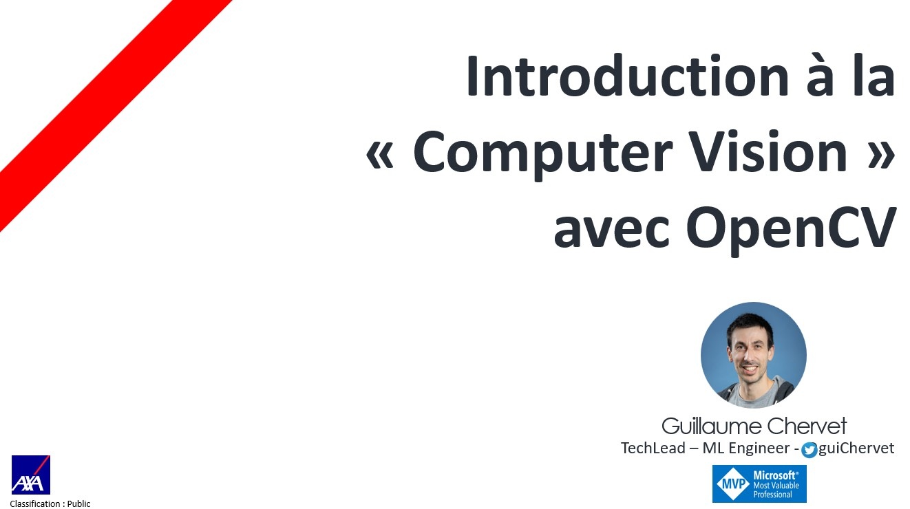

## 1 Introduction

- https://opencv.org/
- https://huningxin.github.io/opencv.js/samples/index.html
- code

## 2 Contours

- code

## 3 Feature matching

- code

## 4 Use case french driver license

- code

## Usefull Links

- Détection object temps reél
https://github.com/PacktPublishing/Learning-OpenCV-4-Computer-Vision-with-Python-Third-Edition
- Color extratcion : https://towardsdatascience.com/color-identification-in-images-machine-learning-application-b26e770c4c71 
https://stackoverflow.com/questions/23660929/how-to-check-whether-a-jpeg-image-is-color-or-gray-scale-using-only-python-stdli
- Image Alignment:
https://scottsuhy.com/2021/02/01/image-alignment-feature-based-in-opencv-js-javascript/

- https://stackoverflow.com/questions/40078625/opencv-mser-detect-text-areas-python
- https://github.com/BruceMacD/Face-Swap-OpenCV 
- https://github.com/opencv/opencv/blob/master/samples/dnn/text_detection.py
- https://becominghuman.ai/how-to-automatically-deskew-straighten-a-text-image-using-opencv-a0c30aed83df?gi=10b5001185ef
- https://docs.opencv.org/3.4/d5/d69/tutorial_py_non_local_means.html
- https://stackoverflow.com/questions/59765277/opencv-remove-the-background-noise-for-tesseract-ocr 
- https://www.programmersought.com/article/704354850/

- https://fazlurnu.com/2020/06/23/text-extraction-from-a-table-image-using-pytesseract-and-opencv/
- https://stackoverflow.com/questions/50829874/how-to-find-table-like-structure-in-image
- https://stackoverflow.com/questions/59182827/how-to-get-the-cells-of-a-sudoku-grid-with-opencv?noredirect=1&lq=1 
- https://www.kaggle.com/vadbeg/opencv-background-removal 
- https://stackoverflow.com/questions/59824040/remove-background-of-an-image-using-opencv
- https://stackoverflow.com/questions/60521925/how-to-detect-the-horizontal-and-vertical-lines-of-a-table-and-eliminate-the-noi
- https://github.com/summererror/extract-table-from-image-opencv/blob/master/imagetable.py

- https://www.programmersought.com/article/76461121/
- https://stackoverflow.com/questions/46143800/removing-isolated-pixels-using-opencv
- https://github.com/YCICI/EAST-OpenCv.git
- https://github.com/Mjrovai/OpenCV-Face-Recognition.git
- https://github.com/arnavdutta/Table-Detection-Extraction/blob/master/table_detection.py

feature-detection-and-matching :
- https://docs.opencv.org/master/d1/de0/tutorial_py_feature_homography.html
- https://blog.francium.tech/feature-detection-and-matching-with-opencv-5fd2394a590

